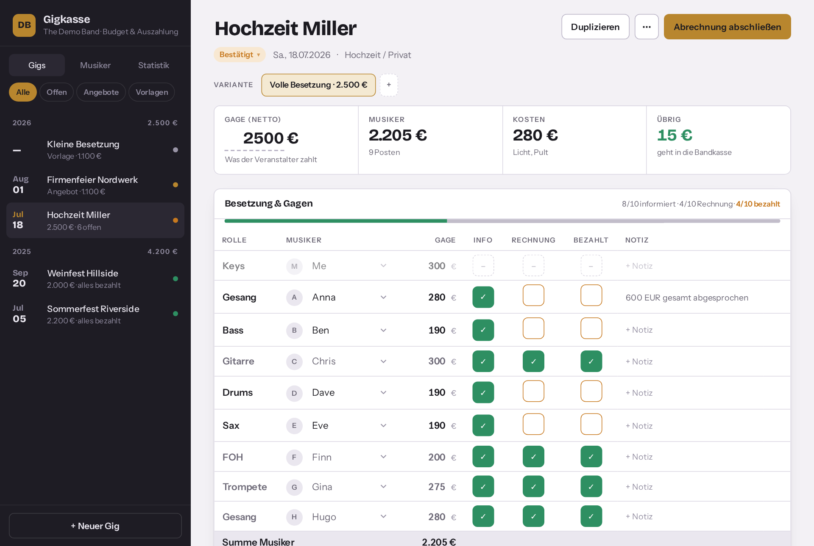
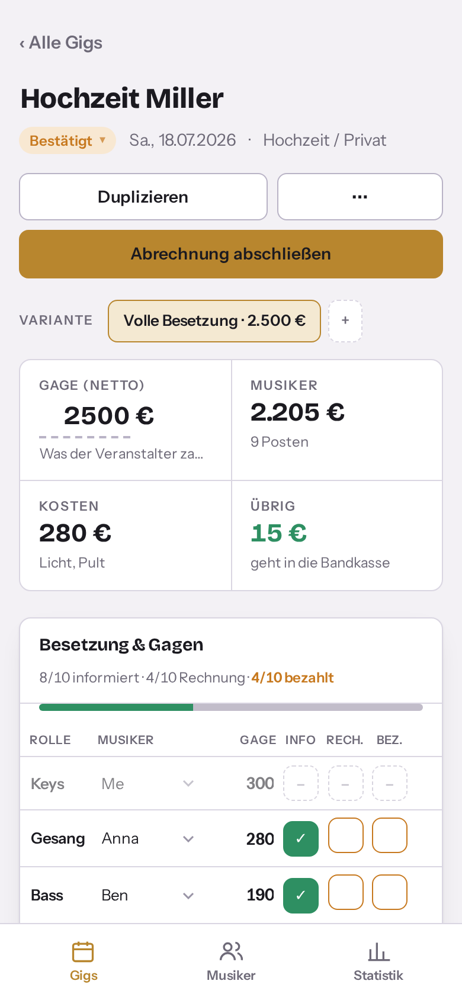

# Band Manager

A small, self-hosted web app for bands that split a gig fee among musicians and
crew: plan the budget, track who has been told their fee, whose invoice has
arrived and who has been paid — and do all of that from your phone, or by
talking to an AI assistant through [MCP](https://modelcontextprotocol.io).

It replaces the spreadsheet with one sheet per gig that many bandleaders keep.

<p align="center"></p>
<p align="center"></p>

## What it does

- **Gigs** – one record per show with date, venue, status
  (`vorlage` template · `angebot` quote · `bestaetigt` confirmed · `abgerechnet` settled · `abgesagt` cancelled)
  and the net fee the promoter pays.
- **Budget lines** – musicians (role, person, amount) and side costs (PA, lights,
  photographer, band fund …). The remainder (*Übrig*) updates live and turns red
  when you overspend.
- **Three checkmarks per line** – *Info* (musician knows their fee), *Rechnung*
  (invoice received), *Bezahlt* (transferred). Each is `open` / `done` / `na`
  (“not applicable”, e.g. the bandleader paying themself).
- **Variants** – several budget scenarios per gig (full line-up vs. small
  line-up) when you are still quoting.
- **Templates** – save a line-up as a template and start new gigs from it,
  amounts pre-filled, checkmarks reset.
- **Musicians** – contact data, default fee, and how many gigs each has played.
- **Stats** – fee per year, what is still owed to whom, band-fund balance from
  the leftover amounts.
- **PWA** – installable on iPhone/iPad (“Add to Home Screen”), responsive
  sidebar-on-tablet / tab-bar-on-phone layout, dark mode.
- **MCP server** – 14 tools so an assistant (Claude, ChatGPT, …) can create
  gigs, build a line-up line by line, tick checkmarks, list open payments and
  draft reminder messages to musicians.

All amounts are **net, whole euros** – the app deliberately stays out of VAT,
because in a typical band some musicians charge VAT and some don't.

## Architecture

One Python process, one SQLite file, one port:

```
/api/*   REST (FastAPI)            – used by the PWA, no auth (keep it on a private network)
/mcp     MCP streamable HTTP       – Bearer token, mountable in an aggregator with namespace "gig"
/        static PWA (vanilla JS)   – no build step
```

- `app/db.py` – schema (`musicians`, `gigs`, `variants`, `line_items`, `events`)
- `app/service.py` – all business logic, shared by REST and MCP
- `app/api.py` – REST routes, contract in [API.md](API.md)
- `app/mcp_server.py` – MCP tools (FastMCP)
- `web/` – the PWA
- `scripts/import_excel.py` – one-off importer for the spreadsheet format described below
- `scripts/smoke_test.py` – end-to-end test against a running instance

## Run it

```bash
git clone https://github.com/hugoheinzson/band-finance-manager.git band-manager
cd band-manager
cp .env.example .env            # set BANDMANAGER_API_TOKEN (openssl rand -hex 32), band name, sender name
docker compose up -d --build
open http://127.0.0.1:8019
```

By default the container binds to `127.0.0.1:8019` only. There is **no login** –
the app trusts the network it is on. To reach it from your phone, pick one:

- **Home LAN / VPN (WireGuard etc.):** set `BANDMANAGER_BIND=0.0.0.0` in `.env`
  and open `http://<host-ip>:8019`. Plain HTTP, so “Add to Home Screen” works
  but the offline service worker stays off (browsers require HTTPS for it).
- **Tailscale:** keep the default binding and publish it tailnet-only with
  valid TLS:
  ```bash
  tailscale serve --bg --https=8443 http://127.0.0.1:8019
  # → https://<your-host>.<tailnet>.ts.net:8443
  ```

Never expose the port to the public internet without putting an
authenticating reverse proxy in front of it.

Data lives in `BANDMANAGER_DATA` (default `~/band-manager-data/band-manager.db`); backing
up is copying that file.

### Without Docker

```bash
uv sync
BANDMANAGER_API_TOKEN=… uv run uvicorn app.main:app --host 127.0.0.1 --port 8019
```

## Import your spreadsheet

The importer understands the workbook layout this project grew out of – one
sheet per gig, named like `2025 20.09. Weinfest`, with the fee in column B,
one line per musician/cost (label in A, amount in C) and the three checkmarks in
E/F/G (`x` = done, `-` = n/a, blank = open). Two budget blocks on one sheet
become two variants.

```bash
cp import-config.example.json import-config.json   # map your labels to people, roles and cost types
uv run python scripts/import_excel.py ~/gigs.xlsx [--reset]
```

`import-config.json` is git-ignored because it contains your musicians' names.

## MCP

Point any MCP client at `http://127.0.0.1:8019/mcp` with
`Authorization: Bearer <BANDMANAGER_API_TOKEN>`, or mount it in an aggregator
(FastMCP: `mcp.mount(proxy(url, headers), namespace="gig")`).

| Tool | Purpose |
|---|---|
| `list_gigs`, `get_gig`, `stats` | Read: overview, one gig with every line and checkmark, per-year figures |
| `open_payments` | Who still needs to be paid (optionally for one gig) |
| `list_musicians`, `upsert_musician` | People and their default fee / contact data |
| `create_gig`, `update_gig` | New gig (optionally from a template or an earlier gig), header changes |
| `set_line`, `remove_line` | Build the line-up: “Bass Ben 190”, “PA 700 as cost” |
| `mark` | Tick *info* / *invoice* / *paid* for a person, a role, or everyone |
| `reminder_targets`, `log_reminder` | Who to nudge for missing invoices, with contact data and a draft text; log that it was sent |
| `gig_history` | Audit trail of checkmarks and reminders |

Gigs can be addressed by id or by title, optionally with a year
(`"Sommerfest 2025"`). Sending the reminder itself is intentionally left to the
assistant and whatever mail/messaging connector it has – the server only
supplies recipients and text.

## Configuration

| Variable | Default | Meaning |
|---|---|---|
| `BANDMANAGER_API_TOKEN` | – | Bearer token for `/mcp` (required) |
| `BANDMANAGER_BAND_NAME` | `Meine Band` | Shown in the UI header and the MCP instructions |
| `BANDMANAGER_SENDER_NAME` | – | Signature under drafted reminder texts |
| `BANDMANAGER_BIND` | `127.0.0.1` | Host address the container port is published on (`0.0.0.0` = LAN/VPN, no login!) |
| `BANDMANAGER_DATA` | `~/band-manager-data` | Host directory for the SQLite file (compose) |
| `BANDMANAGER_DB` | `~/band-manager-data/band-manager.db` | Database path (when running without Docker) |
| `TZ` | `Europe/Berlin` | Container time zone |

## Backup

`deploy/backup.sh` takes a consistent SQLite snapshot (backup API + integrity check),
exports flat CSVs (gigs, line items, musicians), syncs everything to an **encrypted**
rclone remote, keeps 14 daily + 24 monthly copies, and re-downloads the uploaded snapshot
to prove the round trip. A second CSV set without contact data can go to a plain folder
(e.g. Dropbox) for a quick look from the phone. Ships with a systemd user timer
(`Persistent=true`, so a machine that was off catches up on boot) and `deploy/restore.sh`.
Details, install steps and how to verify a backup from another machine:
[deploy/RESTORE.md](deploy/RESTORE.md).

## Development

```bash
uv sync
BANDMANAGER_DB=/tmp/test.db uv run python scripts/demo_data.py     # fictional example data (what the screenshots show)
BANDMANAGER_DB=/tmp/test.db BANDMANAGER_API_TOKEN=test uv run uvicorn app.main:app --port 8019 --reload
BANDMANAGER_API_TOKEN=test uv run python scripts/smoke_test.py
```

UI language is German (the band this was built for is German); the code and
API are documented in German too. Contributions welcome — an i18n layer for the
frontend would be the obvious first one.

## License

MIT
